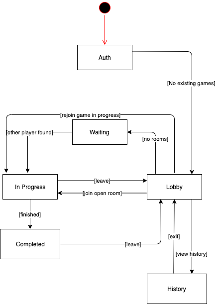

# Task cards

## Auth

* Authenticated with OAuth2 provider -> Lobby

## Lobby

* Start new game
* Continue existing game (optional)
* Invite a friend
* View recent games (history)

## Start new game

* Waiting for another player

## Continue existing game

* Game in progress

## Invite a friend

* Waiting for another player

## View recent games (history)

* Add/remove opponent to/from favorites list
* Block/unblock opponent

## Waiting for another player

* Leave game -> Lobby

## Game in progress

* Leave game -> Lobby
* Add/remove opponent to/from favorites list
* Block/unblock opponent -> Lobby
* Game end summary

## Game end summary

* Add/remove opponent to/from favorites list
* Block/unblock opponent -> Lobby
* Lobby

The tasks above are summarised by this finite state machine:

